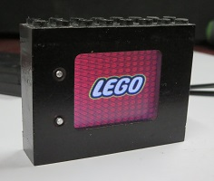

# LegoTV

Software to update and run a small electronic-"picture frame"-esque Lego "construction block" compatible TV

## Project's basic features
- Uses a 1.8in TFT LCD screen (JT-D1800 ?) with ST7735 controller
- Data is stored on a Windbond W25Q128FV SPI flash chip
- Loads TFT configuration + number of image + number of bytes per image from flash data
- Data is spread according to the flash memory sectors optimized to the bytes-per-image length
- Automatically switch to next image after about 5 seconds
- Supports Next and Previous switches

## PIC Firmware 
* The PIC16F88 assembly files of the actual firmware
* Includes a few quick macro for 16bit operations and wrapped ASM branching
* Both methods to send and receive data are shown with conventionnal loop structure and also the faster unwrapped version 

## TFT Data Manager
A simple image library style editor to load and adjust image file to fit the TFT screen and then convert the resulting "library" in a pure flash data file readable by the TFT screen.

* Support Load library, Add library (to current library), Save Library and Export data.
* Basic list of image to load, crop/resize and change position in list
* Export to tightly packed raw data
* Convert image data to different RGB color scheme.

## SPI Flash
Software interface to use the FTDI UM245R as a software SPI interface to transfer the data file into the SPI flash chip.

* Support Windbond W25Q128FV 128mbit SPI flash devices and basic support of SST25VF016B
* Write the data according sector boundary to simplify flash chip ereases and PIC loading (i.e. 32K or 64k)
* Use the FTDI UM245R USB interface as a software emulated SPI host
* Load TFT Data Manager raw data and flash expanded data in windbond chip with proper sector alignment

# The Project

## Physical Components
The "block" is custom machined on a Taig lathe using only DRO for reference and a custom cutter for the studs.

Top and Bottom plates were actually test parts that got fused togheter with a casting of polyurethane plastic then hollowed-out by the same milling setup.

Backplate is the actual SMT PCB

## Electrical Components
* Uses CMOS 3.3V chips for MCU + EEPROM + Display
* Home-made PCB with laser printer transfer sheets
* Diode used to prevent accidental introduction of batteries in reverse oder (project is intended to be used by childen) so 4x1.5V batteries are required in the pack
* Integrated 3.3V LDO regulator
* PIC16F88 with internal 8MHz osc.  Also works with external 20MHz osc by adjusting the internal timing and adding external components but turned-out to only add un-necessary complexity on the PCB witout much impact on usability
* 128Mbit/16Mbyte flash contains either 511 images in RGB444 (actually capped to 255 due to 1 byte num_image variable) or 255 RGB666 (actually RGB888 because lazyness) images

# Media
## Pictures
* [Stud Cutter](media/LegoTV_cutter.jpg)
* [Top and Bottom interface](media/LegoTV_blocInterface.jpg)
* [Fit and final assembly](media/LegoTV_sando.jpg)
* [Final product](media/LegoTV_final.jpg)

## Schematics
* [Block Schematics](media/LegoTV_layout.jpg)
* [PCBs of controller and TFT backplate](media/LegoTV_PCBs.jpg)
* Schematics and PCBs are available as PDF in the repository's [/Schematics/](Schematics/) folder

## Videos
* [Firmware test with circuit on breadboard](https://youtu.be/bwzhosgC7QQ)
* [Post-soldering PCB test](https://youtu.be/HSaehFAtPZ8)
* [PCB with screen inside the block](https://youtu.be/ZGKneOr_af8)
* [Final block with buttons](https://youtu.be/T-MZ-Wergmg)
